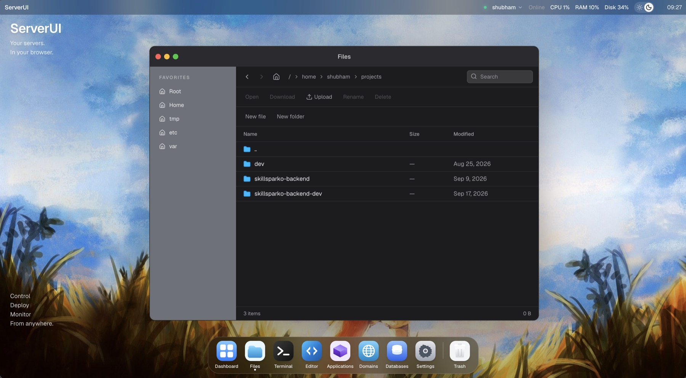

# ServerUI

ServerUI is a modern, open-source control panel for managing your servers from a browser.

It presents a Linux-inspired desktop in the browser. You add SSH servers, connect, and use
Files, Terminal, and live CPU/RAM/disk metrics against the machine you selected. The
browser never opens SSH. A Go backend stores encrypted credentials and dials each host.



## Features

Working in this repository:

- Multi-server add, edit, delete, connect, disconnect, and connection test
- SSH password authentication
- SSH private-key authentication (unencrypted OpenSSH / PEM keys)
- Browser terminal over WebSocket → SSH PTY
- Remote file manager (SFTP)
- CPU, memory, disk, and uptime metrics from the selected server
- Linux-inspired desktop, window manager, and server switcher
- AES-256-GCM encryption for stored credentials

Not implemented yet (UI may show Coming Soon):

- In-browser code editor
- Application, domain, and database management
- Settings app
- ServerUI CLI
- ServerUI agent

See [Current limitations](#current-limitations).

## Architecture

```
Browser
   │
   ▼
Next.js Web
   │  HTTP / WebSocket
   ▼
Go API Server
   ├── PostgreSQL
   └── SSH
        │
        ▼
     Target server
```

Details: [docs/architecture.md](docs/architecture.md).

## How it works

The UI sends a `serverId`. The Go process loads the stored host, decrypts credentials,
and uses a per-server SSH pool. Files, terminal, and metrics are scoped to that ID.

The browser never opens an SSH connection. PostgreSQL holds server records. Secrets are
encrypted at rest with AES-256-GCM. A WebSocket terminal is a PTY on the selected host.
File browsing uses SFTP on that same pooled connection.

## Project structure

```
serverui/
├── apps/
│   ├── web/                 Next.js UI
│   └── server/              Go API, SSH, PostgreSQL
├── deploy/
│   └── docker/              Compose files
├── docs/
│   ├── architecture.md
│   └── images/
├── scripts/
│   └── pre-commit
├── .githooks/
│   └── pre-commit
├── .github/
│   ├── workflows/ci.yml
│   ├── ISSUE_TEMPLATE/
│   └── pull_request_template.md
├── Makefile
├── README.md
├── CONTRIBUTING.md
├── SECURITY.md
├── CODE_OF_CONDUCT.md
├── LICENSE
└── .env.example
```

## Requirements

Verified against this repository:

| Tool    | Version used in development |
| ------- | --------------------------- |
| Git     | any recent                  |
| Docker  | 28.x (Compose v2)           |
| Node.js | 22.x                        |
| npm     | 10.x                        |
| Go      | 1.26                        |
| Make    | GNU Make                    |
| OpenSSL | for generating the encryption key |
| lazydocker | required for `make dev` |

Docker Desktop (or equivalent) must be running for `make start` and `make dev`.

lazydocker is required for `make dev`. It is not required for `make start`.
Install it from [lazydocker](https://github.com/jesseduffield/lazydocker).

## Getting started

```bash
git clone <repository-url>
cd serverui
cp .env.example .env
make setup-env
make hooks
make start
```

`make setup-env` copies `.env.example` when `.env` is missing and generates
`SERVERUI_CREDENTIAL_ENCRYPTION_KEY` if the value is empty.

`make hooks` is optional. It points Git at `.githooks` so local commits run
format, lint, and tests. Hooks can be bypassed; CI is the real gate.

Then open [http://localhost:3000](http://localhost:3000). The API listens on
[http://localhost:8080](http://localhost:8080).

Add a server in the UI (name, host, SSH port, username, password or private key).
ServerUI tests SSH from the Go container, stores the encrypted secret, and connects
when you choose **Connect**.

## Environment configuration

Canonical file: `.env.example` (copy to `.env`). Compose also accepts
`deploy/docker/.env`.

| Variable | Purpose |
| -------- | ------- |
| `POSTGRES_USER` | PostgreSQL user |
| `POSTGRES_PASSWORD` | PostgreSQL password (local only) |
| `POSTGRES_DB` | Database name |
| `HTTP_PORT` | Host port for the Go API |
| `WEB_PORT` | Host port for the web UI |
| `DATABASE_URL` | Optional DSN; `POSTGRES_*` is enough in Compose |
| `SERVERUI_CREDENTIAL_ENCRYPTION_KEY` | 32-byte key as 64 hex chars |

Generate a key:

```bash
openssl rand -hex 32
```

Never commit `.env`, passwords, or private keys. Example hosts in docs use
`203.0.113.10` and user `deploy`.

## Development

```bash
make dev
```

This starts the development Docker environment (bind-mounted source, `next dev`,
`go run`) and opens LazyDocker automatically.

When you exit LazyDocker — or press Ctrl+C — ServerUI's development containers
are removed. The PostgreSQL volume is preserved, so the local database is reused
the next time you run `make dev`.

`make docker-tui` only opens LazyDocker for already-running services. It does not
start or stop the stack.

## Local production start

```bash
make start
```

This builds production images and starts web, API, and Postgres in detached mode.
The command returns immediately. Services keep running after the terminal is free.

```bash
make docker-ps
make docker-logs
make docker-down
```

`make docker-up` starts the development Compose stack in the background without
LazyDocker.

Native checks (after `npm install` in `apps/web`):

```bash
make test
make lint
make format
make format-check
make build
```

Go sources live in `apps/server`. The web app lives in `apps/web`.

## Testing

```bash
make test
```

Runs Vitest in `apps/web` and `go test ./...` in `apps/server`.

## Linting

```bash
make lint
```

ESLint for the web app, `go vet` for the backend.

## Formatting

```bash
make format         # gofmt + Prettier
make format-check   # fail if anything would change
```

## Building

```bash
make build
```

Produces a Next.js production build in `apps/web/.next` and
`bin/serverui-server`. Binaries and `.next` are gitignored.

```bash
make docker-build
```

Builds production Compose images without starting them. `make start` builds and
starts those images. Development images are built by `make dev` / `make docker-up`.

## Security

Credentials are encrypted at rest. GET APIs do not return secrets. See
[SECURITY.md](SECURITY.md).

Report vulnerabilities privately to [contact@skyrekon.com](mailto:contact@skyrekon.com).
Do not attach keys or passwords to issues.

## Contributing

ServerUI is open source under the Apache License 2.0.

- [CONTRIBUTING.md](CONTRIBUTING.md) — setup, branch names, commits, PRs
- [CODE_OF_CONDUCT.md](CODE_OF_CONDUCT.md)
- Issues: bug and feature templates under `.github/ISSUE_TEMPLATE/`
- CI: `.github/workflows/ci.yml` runs format, lint, tests, build, and a Docker image build

Local Git hooks (`make hooks`) block commits when format, lint, or tests fail. Hooks
are optional local safeguards; CI is the gate.

There is no published release process yet. Work happens on the default branch.

## Roadmap

Planned, not available:

- ServerUI CLI
- Optional host agent
- In-browser editor
- Application, domain, and database management
- Settings

## FAQ

**Does the browser SSH to my VPS?**  
No. The Go server does.

**Can I add many servers?**  
Yes. Each has its own stored config, encrypted secret, and SSH connection.

**Are Applications / Domains / Databases real?**  
Not yet. Those windows are Coming Soon placeholders.

**Is there a CLI or agent?**  
No. Makefile targets for them were removed because the code is not in this repository.

## Current limitations

- Not a production-hardened multi-tenant SaaS. Treat it as a self-hosted control panel.
- Passphrase-protected private keys are rejected with an explicit error.
- Host key verification accepts any remote host key (TOFU / pinning is not implemented).
- There is no user login, SSO, or RBAC for the ServerUI app itself.
- Editor, Applications, Domains, Databases, and Settings are not implemented.
- CLI and agent are not implemented.
- No official release tags or installers yet.

## Contact

[contact@skyrekon.com](mailto:contact@skyrekon.com)

Use this address for security reports, contributor questions, and any other contact.

## License

Apache License 2.0. Copyright 2026 Skyrekon Private Limited. See [LICENSE](LICENSE).
