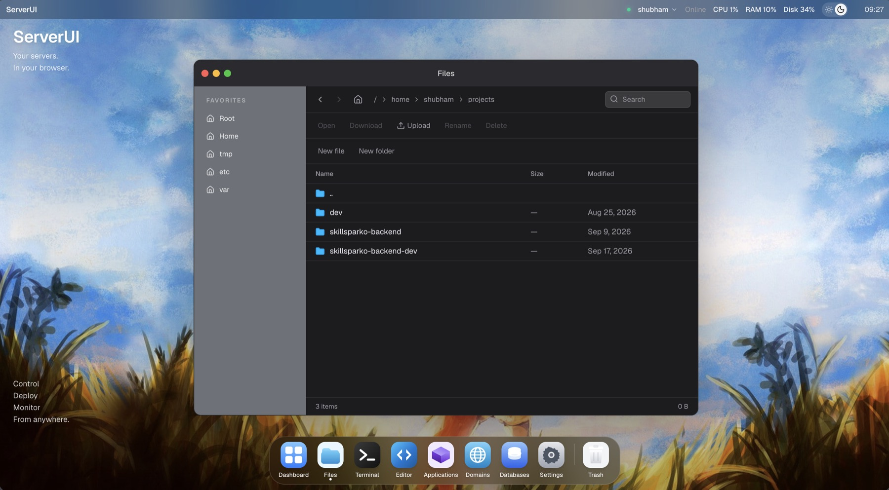

# ServerUI

[](LICENSE)
[](https://github.com/rakhechashubham/serverui/releases)
[](https://github.com/rakhechashubham/serverui/actions)

ServerUI is a modern, open-source control panel for managing your servers from a browser
or the native desktop app.

It presents a Linux-inspired desktop UI. You add SSH servers, connect, and use
Files, Terminal, and live CPU/RAM/disk metrics against the machine you selected.
**Your browser never opens SSH** — a Go backend stores encrypted credentials and
dials each host for you.



## Install

Pick the path that fits you:

| Path | Command | Needs |
| ---- | ------- | ----- |
| **Self-host (one line)** | `curl -fsSL https://raw.githubusercontent.com/Real-Yash/serverui/main/install.sh \| bash` | Docker only |
| **Desktop app** | Download from [GitHub Releases](https://github.com/rakhechashubham/serverui/releases) | Nothing else |
| **From source** | `git clone` + `make start` (below) | Docker, Node 22, Go 1.26, Make |

### One-line self-host

On any machine with Docker running:

```bash
curl -fsSL https://raw.githubusercontent.com/Real-Yash/serverui/main/install.sh | bash
```

This clones stable upstream code into `~/serverui`, generates secrets in `.env`,
and starts the web UI on `http://localhost:3000` (API on `:8080`). First run
builds images, so allow a few minutes. Useful options:

```bash
# Pin a release, custom directory or ports
curl -fsSL https://raw.githubusercontent.com/Real-Yash/serverui/main/install.sh | bash -s -- --version v0.2.0 --dir ~/.serverui
./install.sh --help       # all flags: --web-port, --api-port, --yes, --uninstall
```

The installer pulls upstream releases by default. To install from a fork instead:

```bash
SERVERUI_REPO_URL=https://github.com/Real-Yash/serverui.git ./install.sh
```

### Desktop app

Download the installer for your platform (macOS `.dmg`, Windows `-setup.exe`,
Linux `.AppImage`/`.deb`) from
[GitHub Releases](https://github.com/rakhechashubham/serverui/releases), verify
the SHA-256 checksums, and launch. No Docker, PostgreSQL, Node, Go, or Rust is
needed — local SQLite is created automatically. Details: [docs/releases.md](docs/releases.md).

### From source

```bash
git clone https://github.com/rakhechashubham/serverui.git
cd serverui
cp .env.example .env
make setup-env   # generates SERVERUI_CREDENTIAL_ENCRYPTION_KEY if empty
make hooks       # optional: local commit checks (CI is the real gate)
make start       # build + start web, API, Postgres in the background
```

Then open [http://localhost:3000](http://localhost:3000). The API listens on
[http://localhost:8080](http://localhost:8080).

> Contributing from a fork? Clone your fork instead, then open a PR against
> upstream. See [CONTRIBUTING.md](CONTRIBUTING.md).

Add a server in the UI (name, host, SSH port, username, password or private key).
ServerUI tests SSH from the Go container, stores the encrypted secret, and connects
when you choose **Connect**.

## Features

- Multi-server add, edit, delete, connect, disconnect, and connection test
- SSH password and private-key authentication (unencrypted OpenSSH / PEM keys)
- Browser terminal over WebSocket → SSH PTY
- Remote file manager (SFTP) with archive extraction
  (`.zip`, `.tar`, `.tar.gz`/`.tgz`, `.tar.bz2`, `.tar.xz`, `.7z`),
  using the server's own `tar` / `unzip` / `7z`
- Live CPU, memory, disk, and uptime metrics for the selected server
- Linux-inspired desktop, window manager, and server switcher
- AES-256-GCM encryption for stored credentials
- Settings (About, runtime, shortcuts, desktop updates)

Not implemented yet (UI may show Coming Soon): in-browser code editor;
application, domain, and database management; ServerUI CLI; ServerUI agent.
See [Current limitations](#current-limitations).

## How it works

```
Browser / UI
   │
   ▼
Next.js Web
   │  HTTP / WebSocket
   ▼
Go API Server
   ├── PostgreSQL (web)  or  SQLite (desktop)
   └── SSH ──► Target server
```

The UI sends a `serverId`. The Go process loads the stored host, decrypts
credentials, and uses a per-server SSH pool — files, terminal, and metrics are
scoped to that ID. A WebSocket terminal is a PTY on the selected host; file
browsing uses SFTP on the same pooled connection.

The same Next.js client talks to a remote backend (web) or a local backend
(desktop) via a small runtime helper. Packaged desktop starts its own Go
sidecar on `127.0.0.1:<dynamic-port>` with a per-launch auth token and needs
neither Docker nor PostgreSQL.

Details: [docs/architecture.md](docs/architecture.md),
[docs/desktop.md](docs/desktop.md),
[docs/desktop-security.md](docs/desktop-security.md),
[docs/desktop-storage.md](docs/desktop-storage.md).
Product audit / manual QA: [docs/product-audit.md](docs/product-audit.md),
[docs/manual-qa.md](docs/manual-qa.md).

## Project structure

```
serverui/
├── apps/
│   ├── web/                 Next.js UI (shared by web + desktop)
│   ├── server/              Go API, SSH, PostgreSQL
│   └── desktop/             Tauri desktop shell
├── deploy/
│   └── docker/              Compose files (prod, dev, desktop-db)
├── docs/                    architecture, desktop, releases, QA
├── scripts/                 desktop release helpers, e2e, pre-commit
├── .githooks/               local commit hooks (via `make hooks`)
├── .github/workflows/       ci, desktop matrix, desktop releases
├── install.sh               one-line Docker installer
├── Makefile
├── .env.example             canonical config template (copy to .env)
└── README.md / CONTRIBUTING.md / SECURITY.md / LICENSE
```

## Requirements

| Tool | Version | Needed for |
| ---- | ------- | ---------- |
| Git | any recent | source installs |
| Docker | 28.x (Compose v2), daemon running | `make start`, `make dev`, `install.sh` |
| Node.js / npm | 22.x / 10.x | web dev, builds |
| Go | 1.26 | backend dev, builds |
| Make | GNU Make | all workflows |
| OpenSSL | any (`openssl rand -hex 32`) | encryption key generation |
| Rust / cargo | stable (MSRV 1.77+) | desktop only |
| lazydocker | latest | `make dev` only |

## Configuration

Canonical file: `.env.example` (copy to `.env`; `make setup-env` and
`install.sh` do this plus key generation). Compose also accepts
`deploy/docker/.env`.

| Category | Variable | Purpose |
| -------- | -------- | ------- |
| Runtime | `HTTP_PORT` | Host port for the Go API |
| Runtime | `WEB_PORT` | Host port for the web UI |
| Database | `POSTGRES_USER` / `POSTGRES_PASSWORD` / `POSTGRES_DB` | PostgreSQL (local only) |
| Database | `POSTGRES_HOST` | Defaults to `127.0.0.1` natively; Compose sets `postgres` |
| Database | `DATABASE_URL` | Optional DSN; `POSTGRES_*` is enough in Compose |
| Credentials | `SERVERUI_CREDENTIAL_ENCRYPTION_KEY` | 32-byte key as 64 hex chars (**backend only**, never frontend) |
| API (optional) | `NEXT_PUBLIC_API_BASE` | Browser-facing API origin when not same-origin |
| Deployment | `SERVER_INTERNAL_URL` | Next.js server-side rewrite target (Compose sets this) |

Never commit `.env`, passwords, or private keys. Example hosts in docs use
`203.0.113.10` / user `deploy`.

## Development

| Command | What it does |
| ------- | ------------ |
| `make dev` | Dev stack (bind-mounted source, `next dev`, `go run`) + LazyDocker; containers removed on exit, DB volume kept |
| `make start` | Build + start production stack detached (web, API, Postgres) |
| `make test` | Vitest (`apps/web`) + `go test ./...` + release-helper + desktop (if cargo) tests |
| `make lint` | ESLint + `go vet` |
| `make format` / `make format-check` | gofmt + Prettier / verify only |
| `make build` | Next.js production build + `bin/serverui-server` |
| `make docker-build` / `docker-ps` / `docker-logs` / `docker-down` | Prod image build / inspect / logs / stop |
| `make docker-up` | Dev stack in background without LazyDocker |
| `make desktop-dev` | Tauri + Next.js + local Go backend (SQLite by default, no Postgres needed) |
| `make desktop-build` | Tauri bundle for the current host (unsigned unless CI secrets set) |
| `make desktop-build-macos` / `-windows-x64` / `-linux-x64` | Native per-OS installers (run on that OS) |
| `make desktop-build-all` | Prints the full CI release flow (tags → GitHub Actions matrix) |

Desktop details: [apps/desktop/README.md](apps/desktop/README.md),
[docs/releases.md](docs/releases.md). Go sources live in `apps/server`;
the web app lives in `apps/web`.

## Security

Credentials are encrypted at rest (AES-256-GCM); GET APIs never return secrets.
See [SECURITY.md](SECURITY.md).

Report vulnerabilities privately to [contact@skyrekon.com](mailto:contact@skyrekon.com).
Do not attach keys or passwords to issues.

## Contributing

ServerUI is open source under the Apache License 2.0.

- [CONTRIBUTING.md](CONTRIBUTING.md) — setup, branch names, commits, PRs
- [CODE_OF_CONDUCT.md](CODE_OF_CONDUCT.md)
- Issues: bug and feature templates under `.github/ISSUE_TEMPLATE/`
- CI (`.github/workflows/ci.yml`) runs format, lint, tests, build, and a Docker
  image build; desktop releases are tag-driven
  (`.github/workflows/desktop-release.yml`)

## Roadmap

Delivered: desktop packaging matrix (macOS arm64+x64, Windows x64, Linux x64)
+ release CI, local SQLite + OS keychain storage, one-line Docker installer.

Planned: code signing / notarization (secrets-dependent), prebuilt GHCR images
for instant installs, ServerUI CLI, optional host agent, in-browser editor,
application / domain / database management.

## FAQ

**Does the browser SSH to my VPS?**
No. The Go server does.

**Can I add many servers?**
Yes. Each has its own stored config, encrypted secret, and SSH connection.

**One-line install vs `make start`?**
Same stack. The installer is for users who just want it running (Docker only);
`make start` is for contributors working from a clone.

**How do I update / uninstall the one-line install?**
Re-run the installer with the same `--dir` to update. Stop with
`./install.sh --uninstall` (DB volume is kept; `docker volume rm
serverui-postgres-data` wipes it).

**Are Applications / Domains / Databases real?**
Not yet. Those windows are Coming Soon placeholders.

**Is there a CLI or agent?**
Not yet — both are on the roadmap.

## Current limitations

- Not a production-hardened multi-tenant SaaS. Treat it as a self-hosted control panel.
- No user login, SSO, or RBAC for the ServerUI app itself.
- Passphrase-protected private keys are rejected with an explicit error.
- Host key verification accepts any remote host key (TOFU / pinning is not implemented).
- Editor, Applications, Domains, Databases, CLI, and agent are not implemented.
- Archive extraction needs `tar` (plus `gzip` / `bzip2` / `xz`), Info-ZIP `unzip`, or
  `7z` on the server. Password-protected archives, `.rar`, and single compressed
  files such as `.gz` are not supported.
- Desktop code signing / notarization depend on CI secrets and are not claimed
  complete until configured and verified.
- Official GitHub Release tags publish when maintainers cut `vX.Y.Z`.

## Contact

[contact@skyrekon.com](mailto:contact@skyrekon.com) — security reports,
contributor questions, and any other contact.

## License

Apache License 2.0. Copyright 2026 Skyrekon Private Limited. See [LICENSE](LICENSE).
