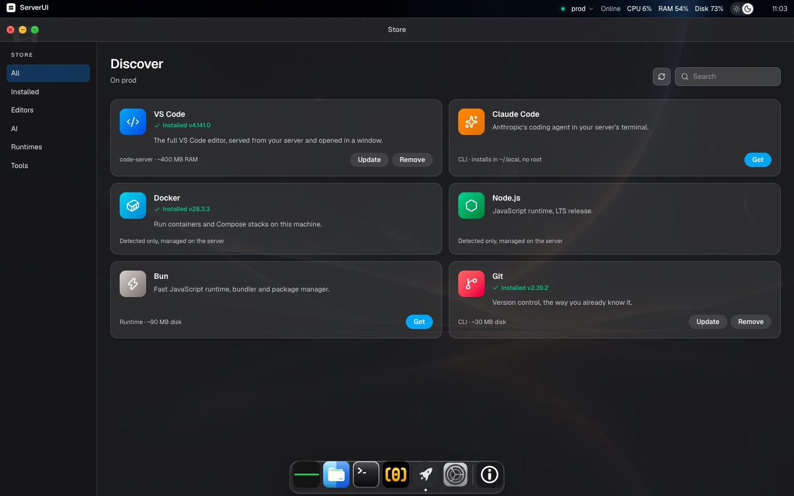
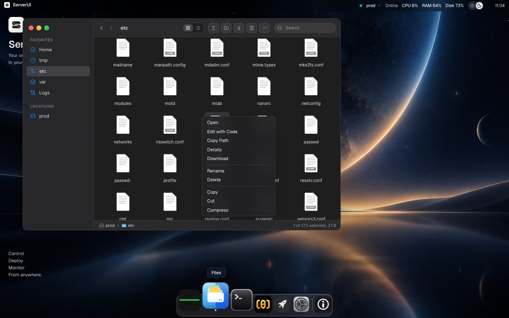
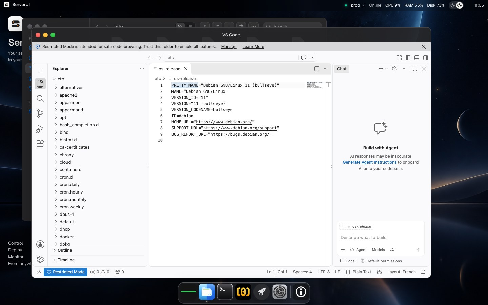

# Store: how it works and how to add an app

The Store window shows which tools are installed on the selected server and lets you
install, update, or remove them. VS Code is the one app that also opens inside ServerUI.



Everything the Store can do is a fixed list that lives in the code. The browser never sends a
shell command: it sends an app id and an action (`install`, `update`, `remove`), and the
backend runs the script it already has for that pair.

## How it works

1. **Detection.** Opening the Store (or pressing the refresh button) runs one script over SSH.
   For each app it checks `command -v <bin>` and, when found, runs the app's version command.
   The result is a list of `{ id, installed, version, actions }`.
2. **Actions offered.** Not installed: `install`. Installed: `update` and `remove`. An action is
   only offered if the app has a script for it. An app with no scripts is detect-only (Docker
   and Node.js are).
3. **Jobs.** An action runs in the background as a job. The card shows its log tail and the
   result. Only one job per app and server runs at a time.
4. **Verification.** When a script exits with 0, the backend detects again. `install` and
   `update` must leave the app on the PATH, `remove` must take it off. Otherwise the job fails.
   This matters: some installers print their usage and still exit 0.

Code map:

| Part | File |
|---|---|
| Catalogue and scripts | `apps/server/internal/appstore/catalog.go` |
| Detection, jobs, verification | `apps/server/internal/appstore/service.go` |
| HTTP routes | `apps/server/internal/api/store.go` |
| Cards, filters, job log | `apps/web/src/components/apps/ApplicationsApp.tsx` |
| Names, icons, descriptions | `apps/web/src/data/store-catalog.ts` |
| API client | `apps/web/src/lib/api/store.ts` |

## Add an app

An app needs two entries that share the same `id`. The Go entry decides what runs, the web
entry decides how the card looks.

### 1. The Go entry (`catalog.go`)

Add an `App` to `Catalog`:

```go
{
	ID:      "tmux",
	Bin:     "tmux",
	Version: `tmux -V | awk '{print $2}'`,
	Install: distroPkg("install", "tmux"),
	Update:  distroPkg("update", "tmux"),
	Remove:  distroPkg("remove", "tmux"),
},
```

tmux is only an illustration and is not in the catalogue. Check your own version command on a
real server before relying on it.

| Field | Meaning |
|---|---|
| `ID` | Stable id, lowercase. Must match the web entry. |
| `Bin` | The executable looked up with `command -v`. This is what "installed" means. |
| `Version` | A pipeline that prints the version on one line. If it prints nothing, the card says "installed" without a number. |
| `Install`, `Update`, `Remove` | Shell scripts. Leave one empty to not offer that action. |

Script rules:

- **POSIX `sh`.** Scripts run through `sh -c`, which is `dash` on Debian. Use bash only by
  calling it explicitly, as `fetchAndRun(url, "bash", "")` does.
- **Never interactive.** There is no terminal and no stdin. Pass non-interactive flags
  (`-y`, `DEBIAN_FRONTEND=noninteractive`).
- **Prefer user-level installs** (`~/.local`, as code-server, Claude Code, and Bun do). They need
  no root and are easy to remove.
- **System packages** use the helpers: `distroPkg(op, pkg)` handles apt, dnf, and apk and starts
  with `needRoot`, which sets `$SUDO` to nothing (root), `sudo -n`, or stops with
  "root or passwordless sudo is required".
- **Downloaded installers** go through `fetchAndRun(url, interpreter, args)`. It saves the file
  first, so a failed download stops the script instead of hiding behind a pipe.
- **The PATH.** The prelude adds `~/.local/bin` and `~/.bun/bin`. If your app installs
  somewhere else, add it to `prelude`, or detection and verification will not find it.
- **Be idempotent.** Running install twice must be safe.
- **Explain failures on the last line.** If a script fails, the last line of its output becomes
  the error shown on the card. `echo "<reason>"; exit 1` is better than a raw exit status.
- **Remove what you installed, keep what the user made.** code-server's remove stops the process
  and deletes the binary but keeps `~/.config/code-server`. Claude Code keeps `~/.claude`.
- **Be careful with destructive apps.** If removing the app can break other things (containers,
  databases), make it detect-only: give it no scripts.

### 2. The web entry (`store-catalog.ts`)

Add a `StoreApp` to `STORE_CATALOG`:

```ts
{
  id: "tmux",
  name: "tmux",
  tagline: "Terminal multiplexer: keep sessions alive when you disconnect.",
  category: "Tools",
  icon: Terminal,
  tint: "from-green-400 to-emerald-700",
  footprint: "CLI · ~1 MB disk",
},
```

- `category` must be one of `STORE_CATEGORIES` (`Editors`, `AI`, `Runtimes`, `Tools`). To add a
  category, add it to that list and it appears in the sidebar.
- `icon` is any [lucide-react](https://lucide.dev) icon, imported at the top of the file.
- `tint` is a Tailwind gradient (`from-... to-...`) for the icon tile.
- `footprint` is one short line that tells the user what lands on their server.

The card shows actions from the backend, so nothing else is needed in the UI.

### 3. Check it

```bash
go -C apps/server test ./internal/appstore   # also syntax-checks every script with sh -n
cd apps/web && npm test && npm run lint && npx tsc --noEmit
```

`make test` and `make lint` run the same checks for the whole repository.

`TestEveryScriptParsesAsShell` loops over the whole catalogue, so a typo in your script fails
the test without running anything. Then try it for real on a **throwaway server**: install,
refresh, update, remove, and check the version command prints what you expect. Unit tests
use a fake runner and do not run your installer.

## Apps that open inside ServerUI (VS Code)

Installing a binary is enough for a command-line tool. Some apps also have a web interface you
may want in a window. VS Code (code-server) is the example, in `apps/server/internal/codeserver`:

- ServerUI starts code-server on the server, listening on a **Unix socket with mode 600**
  (`~/.local/share/serverui/code-server.sock`). Nothing listens on a network port, and only the
  SSH user can reach the socket.
- The backend reverse-proxies HTTP and WebSockets to that socket through the existing SSH
  connection, under `/api/code/{serverId}/`.
- The web app has a `vscode` window (`VsCodeApp.tsx`) that calls `POST /api/code/{id}/start`
  and shows the proxied page in an iframe.
- Files shows "Edit with Code" only when the Store detected code-server on that server.





To do the same for another app, it has to cooperate with a proxy:

- Prefer a Unix socket (as code-server offers). A TCP port on `127.0.0.1` is reachable by every
  local user on the server, so it needs its own password.
- It must work under a URL prefix (`/api/code/<id>/`). Many web apps do not. Test this first.
- It must use relative URLs, since the browser URL keeps the trailing slash and the apps resolve
  against it. This is also why `next.config.ts` sets `skipTrailingSlashRedirect: true`.
- It must accept WebSockets through the proxy and check the `Origin` against the host the browser
  used. The proxy forwards the public host for this.

## Limits

- "Update" reinstalls the latest version. There is no "update available" indicator and no
  version pinning yet.
- Installers are the vendors' own scripts (`code-server.dev`, `claude.ai`, `bun.sh`) and need
  `curl` on the server. Git needs apt, dnf, or apk.
- VS Code works in the web app only. The desktop app sends its local auth token as a header,
  which an iframe cannot do.
- Closing the VS Code window does not stop code-server on the server. Removing it from the Store
  does.
- ServerUI has no login of its own, so anyone who can reach ServerUI can reach the VS Code it
  proxies. Protect ServerUI itself accordingly.

## API

| Route | Purpose |
|---|---|
| `GET /api/store/apps?serverId=` | Detection: `{ apps: [{ id, installed, version?, actions }] }` |
| `POST /api/store/jobs` | Body `{ serverId, appId, action }`. Returns a job, or `404` unknown app, `400` action not offered, `409` already running |
| `GET /api/store/jobs/{job}?serverId=` | Job state: `running`, `done`, or `failed`, with `log` and `error` |
| `POST /api/code/{id}/start` | Starts code-server, returns `{ path }`. `409` if it is not installed |
| `/api/code/{id}/...` | The proxied code-server |

Jobs live in memory only. A finished job is kept at least 10 minutes (it is dropped when the
next job starts), keeps the last 200 log lines, and a running job times out after 15 minutes.
